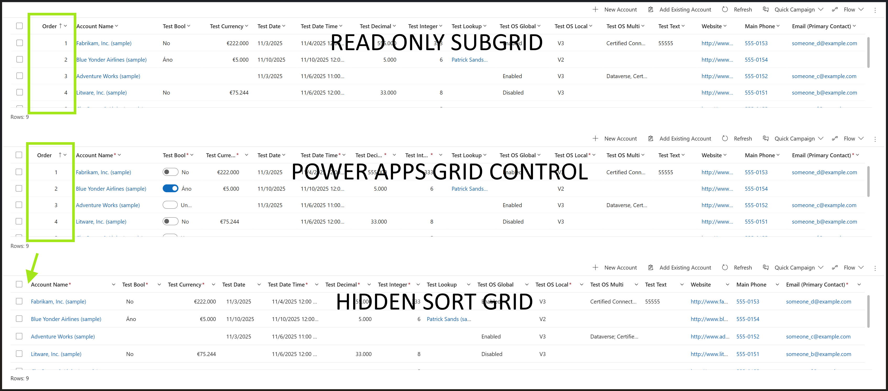
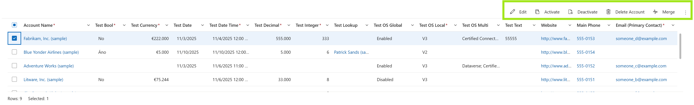
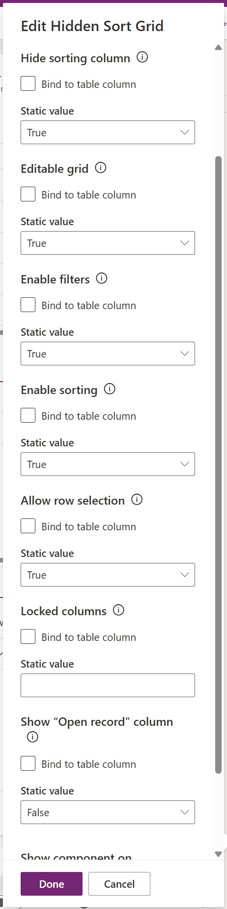
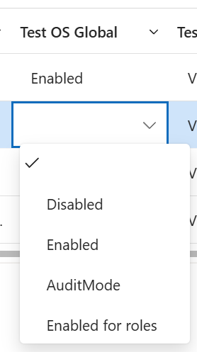
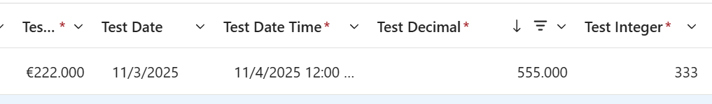
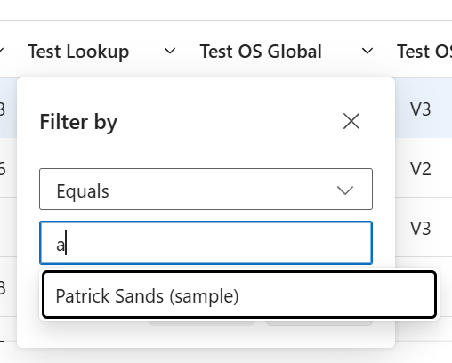
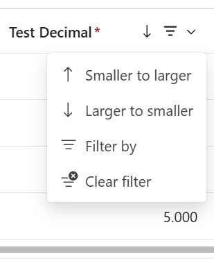
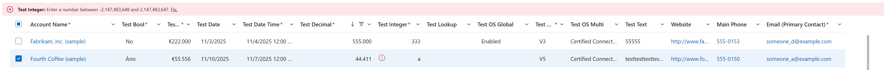

# HiddenSortGrid

**Switchable readonly/editable PCF OOB-like subgrid with optional sorting, filters, and support for hidden and locked columns.**

---

## 🧩 Overview

HiddenSortGrid is a **Fluent UI v9 DataGrid**-based Power Apps **custom PCF control** for Dynamics 365 / Power Apps model-driven apps that extends the functionality of the standard OOB subgrid.

It was built to provide makers with more flexibility in displaying related records while maintaining the familiar user experience of the native subgrid.

For example, it’s ideal when you need to display sorted ranges — such as financial ranges (e.g., rating bands, price categories, or VAT intervals) or shoe and clothing sizes — where sorting relies on a technical field that you don’t want users to see.

No additional dependencies. 100% client-side.

---

## ✨ Features

- 🟡 **Hide the sorting column** — the primary feature that removes the technical sort column for cleaner UI.  
- 🟢 **Readonly / Editable switchable mode** — toggle between view and edit directly in the same grid.  
- 🔵 **Enable / Disable filtering** — control whether users can apply quick filters.  
- 🟣 **Enable / Disable sorting** — lock sorting completely if desired.  
- 🟠 **Allow / Disallow row selection** — prevent accidental record selection in readonly mode.  
- 🟤 **Lock specific columns** — in editable mode, choose which columns remain non-editable by default.  
- 🔗 **Show “Open record” column** — adds an extra column with an “open in new tab” action for each row (optional).  

---

## 📸 Screenshots

### 🔹 Subgrids comparison
  
Comparison of the standard **Read-Only Subgrid**, **Power Apps Grid Control**, and **Hidden Sort Grid**.  
Hidden Sort Grid combines editable grid functionality with a clean look — without displaying the helper “sort” column.

---

### 🔹 OOB-like command bar
  
Fully compatible with the standard **Command Bar** (Ribbon).  
When users select rows, the control behaves just like the native grid component.

---

### 🔹 Maker settings
  
Configuration options available to makers — toggle filtering, sorting, inline editing, locked columns, and the “Open record” icon visibility.

---

### 🔹 Editable columns
  
The grid supports inline editing for multiple field types (text, number, date/time, lookup, boolean) directly in the view — just like the Power Apps Grid Control.

---

### 🔹 Formats reflect fields and user settings
  
Field formats (currency, dates, numbers, etc.) automatically respect both Dataverse field metadata and the user’s personal settings.

---

### 🔹 OOB-like filtering
  
Supports built-in Power Apps-style filtering, including text search, lookup filters, and numeric range filters.

---

### 🔹 OOB-like sorting
  
Enables column sorting without exposing the technical “sort order” column — maintaining a clean and minimal layout.

---

### 🔹 OOB-like error banner
  
Validation errors are displayed using the native Power Apps banner style, including number range and formatting validation.

---

### 🔹 Status column
  
Each row now includes a status indicator column, showing the current state of the record.

- No icon – the row is valid and has no pending actions  
- Validation error – a red error icon is shown when the row contains invalid data  
- Saving – a progress spinner appears while the row is being updated  
- Save successful – a green checkmark is displayed for 5 seconds after a successful update  
- Save failed – a red error icon is displayed for 5 seconds if the update fails

---

## ⚙️ Configuration

| Property | Description |
|-----------|-------------|
| **Hide Sorting Column** | Hides the sorting header/column from the grid UI. Default: enabled. |
| **Readonly/Editable** | Switch between display modes. Default: disabled. |
| **Enable Filters** | Allows quick filtering in the grid. Default: enabled. |
| **Enable Sorting** | Enables or disables sorting per column. Default: enabled. |
| **Allow Row Selection** | Determines if rows can be selected. Default: enabled. |
| **Locked Columns** | Comma-separated list of columns locked in editable mode. Default: empty. |
| **Show Open Record Column** | Adds an action column that opens the record (new tab). Default: disabled. |

---

## 🚀 Installation

1. Import the managed solution (`DynamiX - HiddenSortGrid`) into your environment.  
2. Add the **HiddenSortGrid** control to a subgrid on your form.  
3. Configure the desired properties (see table above).  
4. Publish and enjoy your cleaner, more flexible subgrid experience.

---

## 📦 Solution Info

| Item | Value |
|------|-------|
| **Solution name** | `DynamiX - HiddenSortGrid` |
| **Publisher** | Bendi DynamiX |
| **Prefix** | `dmx` |
| **Version** | `1.0.1.0` |
| **License** | [MIT](LICENSE) |

---

## 🧠 Notes

- Designed for **model-driven apps** (OOB subgrid replacement).  
- Fully compatible with **Dataverse** and standard PCF deployment.  
- Tested with the latest Dynamics 365 and Power Apps environments.  

---

## 🧩 Known Limitations / Future Enhancements

- 🔸 **Lookup fields** are currently readonly in editable mode.  
- 🔸 **Multiselect OptionSets** are not yet editable.  
- 🔸 **Virtualization / incremental loading** is not implemented yet.  

These features are planned for future updates once the core functionality is fully stabilized.

---

## 🧑‍💻 Author

**Martin Beno**  
Bendi DynamiX  
[LinkedIn](https://www.linkedin.com/in/martin-beno-dynamics365-ce)  
[GitHub Profile](https://github.com/bendi-dynamix)

---

## 🪪 License

Released under the [MIT License](LICENSE).
